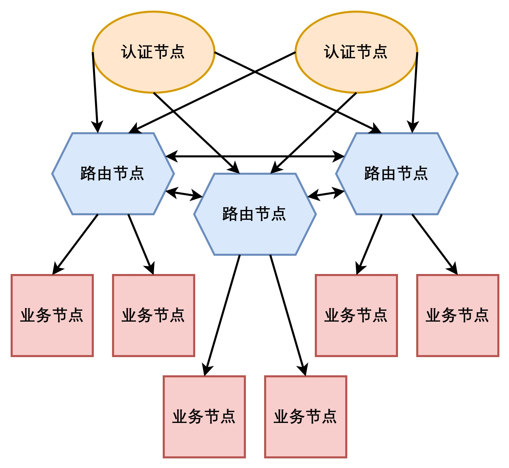

# Sparrow

## 1. 介绍
Sparrow是一个轻量级的分布式服务器框架，基于Boost.Asio和C++20协程。

框架主要由三种节点组成，分别是认证服务器、路由服务器、业务服务器，它们的关系如下图如所示：



- 已实现的功能：

    1. 日志服务
    2. 自动化的服务注册和发现(基于redis)
    3. 路由节点和业务节点的负载均衡
    4. 业务服务器故障转移
    5. 简单的错误处理

- 在main分支中实现了以下功能：

    1. `客户端`连接到`认证服务器`
    2. `认证服务器`向负载最低的`路由服务器`请求一个`业务服务器`
    3. `路由服务器`返回负载最低的`业务服务器`地址
    4. `认证服务器`将`路由服务器`返回的地址发送到`客户端`
    5. `客户端`使用`认证服务器`回复的地址连接到`业务服务器`

- 未来计划
    1. 实现更详细的错误处理
    2. 实现插件机制，提高扩展能力和简化开发难度
    3. 扩展负载均衡器，增加冗余机制
    4. 使用C++20 module重构
    5. 增加其他基础会话类型

## 2. 构建项目

### 2.1. 安装vcpkg
```shell
git clone https://github.com/microsoft/vcpkg && cd vcpkg
```
`Windows`
```shell
.\bootstrap-vcpkg.bat
```
`Linux `
```shell
sudo apt-get install git cmake curl zip unzip tar pkg-config && ./bootstrap-vcpkg.sh
```

### 2.2. 安装依赖
`Windows`
```shell
./vcpkg install openssl:x64-windows boost-uuid:x64-windows boost-asio:x64-windows nlohmann-json:x64-windows boost-mysql:x64-windows protobuf:x64-windows redis-plus-plus:x64-windows spdlog:x64-windows boost-beast:x64-windows parallel-hashmap:x64-windows
```

`Linux`
```bash
./vcpkg install openssl:x64-linux boost-uuid:x64-linux boost-asio:x64-linux nlohmann-json:x64-linux boost-mysql:x64-linux protobuf:x64-linux redis-plus-plus:x64-linux spdlog:x64-linuxlinux boost-beast:x64-linux parallel-hashmap:x64-linux
```

### 2.3. 构建运行

`Windows`
```
在Visual Studio 2022中打开项目 -> 生成 -> 全部生成
```

`Linux`
```
⚠️还未测试
```

## 3. 在框架的基础上开发

### 3.1. 创建新的会话类型

所有的会话类型都以CRTP的方式继承自`websocket_session`和`std::enable_shared_from_this`，使用`std::make_shared`构造，并实现以下接口：

| 成员函数 | 描述 |
| --- | --- |
| net::awaitable<void> handle_messages_impl | 处理和转发消息协程 |
| std::string server_name | 返回服务器的名字 |
| cancellation_signals& signals | 返回服务器的signals |
| void start_impl | 启动会话 |
| void stop_impl | 停止会话 |

### 3.2. 创建新的服务器类型

| 成员函数 | 描述 |
| --- | --- |
| void start_impl | 启动服务器 |
| void stop_impl | 停止服务器 |
| void store_impl | 存储必要信息 |
| void temp_add_impl | 添加临时会话到列表 |
| void perm_add_impl | 添加正式会话到列表 |
| void temp_remove_impl | 从列表中移除临时会话 |
| void perm_remove_impl | 从列表中移除正式会话 |
| net::awaitable<void> load_updater_impl | 更新服务器负载 |
| void task_request_impl | 传递任务请求 |
| void task_response_impl | 传递响应请求 |

### 3.3. 创建新的消息类型
将消息添加到对应的.proto文件中，然后使用vcpkg安装的protobuf带的protoc编译器生成对应的.h和.cc文件
- 添加消息
```proto
//example
message new_message
{
	string name = 1;
	int32 id = 2;
}
```
- 编译消息
    - 服务器之间的消息
    ```shell
    ./protoc --cpp_out=. server_message.proto
    ```
    - 客户端和服务器之间的消息
    ```shell
    ./protoc --cpp_out=. server_message.proto
    ```

- 刷新`CMakeLists.txt`应用新的消息类型

### 3.4. 负载均衡器
业务服务器和路由服务器都使用默认的负载均衡算法：最小连接数

### 3.4.1 负载均衡器的结构
| 成员函数 | 描述 |
| --- | --- |
| add_server | 将会话添加到负载均衡器 |
| remove_server | 从负载均衡器中移除会话 |
| commit | 提交操作到负载均衡器 |
| start | 启动 |
| stop | 停止 |
| size | 返回持有的会话数量 |
| empty | 判断是否为空 |
| for_each | 对每个会话执行操作 |

### 3.4.2 设计其他负载均衡算法
所有的负载均衡算法使用CRTP继承自`algorithm_interface`和`std::enable_shared_from_this`，实现上述接口的 **_impl** 。
